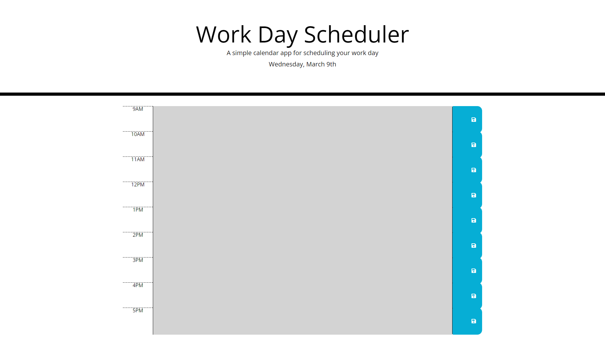

# Day-Planner

This project involved going BACK to the back-end and mainly handling all the jquery with some mild HTML. The bulk of the work was making sure the information entered into the text area was stored and accessed properly to allow the user to actually use this App in their daily life if they so choosed. In order for the page to remain accurate I was forced to use a new tool. Let me take a MOMENT to tell you about it!

## "Let's Do The Time Warp!"

The new tool used throughout this project and the main thing powering it is the moment javascript tool. It allows for the real life local time to be checked and the elements on the page to be updated when necessary which allows the App to be accurate and used properly. It's amazing what one new tool can do. Though it was strange to debug this because I had to keep in mind the actual time since that affects how the page looks. Also, it's just a jump to the left... And then a step to the links! Put your hands on your mouse! And bring your cursor in tight! Then there's the website link! That really drives you insane! LETS DO THE TIME WARP AGAaaiii... You get the idea.

## Links

[Github Repository](https://github.com/JGuerrero126/Day-Planner)

[The Website](https://jguerrero126.github.io/Day-Planner/)

# Images/Screenshots

